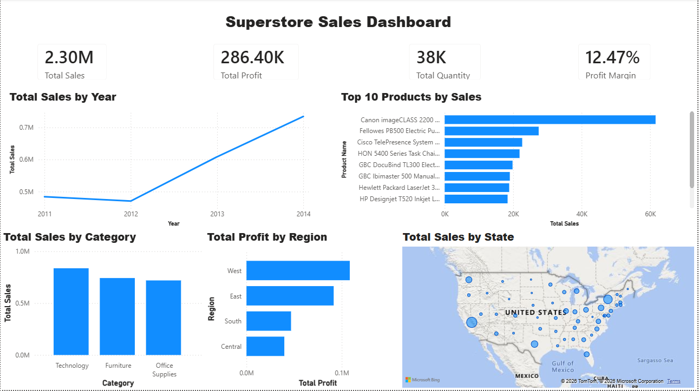

# Superstore Sales Dashboard | Power BI

## Project Overview
This project analyzes Superstore sales data using **Power BI** to provide actionable business insights. The dashboard helps visualize sales performance, profitability, product performance, regional trends, and state-wise sales distribution through interactive dashboards.

---

## Objectives
- Analyze overall sales, profit, and quantity sold.
- Identify the top-performing products by sales.
- Compare sales across product categories.
- Evaluate regional profit performance.
- Visualize state-wise sales distribution.
- Support data-driven business decisions.

---

## Tools Used
- Power BI
- Power Query
- DAX (Data Analysis Expressions)
- Microsoft Excel

---

## Dataset
The dataset contains Superstore sales transaction records, including:
- Order Date
- Product Name
- Category
- Sales
- Profit
- Quantity
- Region
- State
- Customer Information

---

## Dashboard KPIs

| KPI | Value |
|------|-------|
| Total Sales | **2.30M** |
| Total Profit | **286.40K** |
| Total Quantity | **38K** |
| Profit Margin | **12.47%** |

---

## Dashboard Features
-  Total Sales by Year
-  Top 10 Products by Sales
-  Total Sales by Category
-  Total Profit by Region
-  Total Sales by State (Map Visualization)
-  KPI Cards for Sales, Profit, Quantity, and Profit Margin

---

## Key Insights
- Total sales reached **2.30M** with a **12.47%** profit margin.
- Sales increased steadily from **2012 to 2014**.
- **Technology** generated the highest sales among all categories.
- The **West** region recorded the highest profit.
- A small number of products contributed significantly to overall revenue.
- Sales were concentrated in major states across the United States.

---

## Project Workflow
1. Imported the dataset into Power BI.
2. Cleaned and transformed the data using Power Query.
3. Created DAX measures for KPIs.
4. Built interactive charts, maps, and KPI cards.
5. Designed an interactive dashboard.
6. Analyzed business performance and generated insights.

---

## Skills Demonstrated
- Data Cleaning
- Data Transformation
- Data Modeling
- DAX
- Data Visualization
- Dashboard Design
- Business Intelligence
- Analytical Thinking

---

## Dashboard Preview

---

## Author

**Vaishnavi**

Aspiring Data Analyst | SQL | Excel | Power BI | Python
